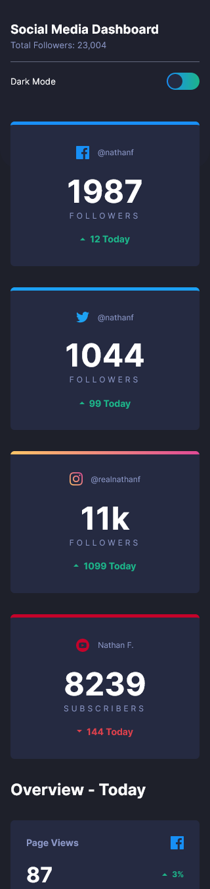

# Frontend Mentor - Social media dashboard with theme switcher solution

This is a solution to the [Social media dashboard with theme switcher challenge on Frontend Mentor](https://www.frontendmentor.io/challenges/social-media-dashboard-with-theme-switcher-6oY8ozp_H). Frontend Mentor challenges help you improve your coding skills by building realistic projects. 

## Table of contents

- [Overview](#overview)
  - [The challenge](#the-challenge)
  - [Screenshot](#screenshot)
  - [Links](#links)
- [My process](#my-process)
  - [Built with](#built-with)
  - [What I learned](#what-i-learned)
  - [Continued development](#continued-development)
- [Author](#author)

## Overview

### The challenge

Users should be able to:

- View the optimal layout for the site depending on their device's screen size
- See hover states for all interactive elements on the page
- Toggle color theme to their preference

### Screenshot

### Links

- Solution URL: [repo link](https://github.com/alfredthompsonOvie/social-media-dashboard-with-theme-switcher)
- Live Site URL: [live site](https://eivo-social-media-dashboard-with-theme-switcher.netlify.app)

## My process

### Built with

- Semantic HTML5 markup
- CSS custom properties
- Flexbox
- CSS Grid
- Mobile-first workflow
- vanilla javascipt

### What I learned

I learnt how to customise the input checkbox with css

### Continued development

In the future I would love to rebuid this project using vue.js. 

## Author

- Frontend Mentor - [@alfredthompsonovie](https://www.frontendmentor.io/profile/alfredthompsonOvie)
- Twitter - [@Eivo_official](https://www.twitter.com/Eivo_official)

